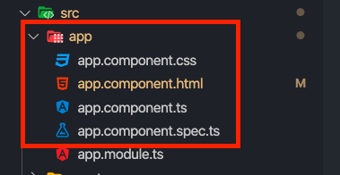

The page which we reach at `localhost:4200` is where our development server hosted by the cli - `Angular cli`.



The content we see can be changed by going to the `app.component.html` file in our app folder. In ehere we can output some text.

For example: a h1 tag with a normal text 'Hello World'. I will comment the default layout for demo purpose.



Result:



So how does our browser or how does the server hosting our app. We think that the content is rendering by `app.component.html` file. Actually, this is not the file served by the server. Instead the `index.html` file is the served by the server.

> Angular is a framework which allows us to create single page application.

Let's take a look at the `index.html` file. We see this is just a normal HTML file. In the `body` tag, we get an emty `app-root` element. But currently, we see a `Hello world` text which we described above. So somehow the `index.html` file seems to have changed. Guess what?! It's because of the `app-root` element. The `app-root` is not a default HTML element instead this is one of our components.



The root component of our application, the component which will tie together our whole application in the end. All the files in the app folder which have component in their name are related to this component - `app-root`.



Let's take a closer look at the `app.component.ts` file



You can see that we have `@Component` decorator, this seems to be important but more importantly, is the `selector` property which assigns a string as a value and the string hold `app-root`. This clearly is a same text in our `index.html` file.

Actually, this is the information that Angular needed to be able to replace the `app-root` element by the content in `app.component.html` file.

So how is Angular triggered to run over body of `index.html` file? By view source code of the page which run at `localhost:4200`



We get a couple of script imports at the end of body. These are injected by the CLI automatically. That why we dont see any scripts tag in our `index.html` file. These script will contain our code so they are actually the first code to be executed.

So is the code we write in our `main.ts` file is the first code?



The answer is yes. You can see that we get a couple of imports and the `environment` which we check if we are in production mode or not... But most importantly is in this line:

```javascript
...

platformBrowserDynamic()
  .bootstrapModule(AppModule)
  .catch((err) => console.error(err));
```

This `bootstraps` starts our Angular application by passing an `AppModule` to this method. The `AppModule` is refer to `app.module.ts`.



Most importantly in this file is the `bootstrap` array which basically lists all the compoennts which should be known to Angular at the point of the time it analyzes our `index.html` file. And here the circle closes because we reference our app component.

### Summary

Angular get started the `main.ts` file, in there we `bootstrap` an Angular application and we pass `app.module.ts` as an argument. In this module, we tell Angular which component should be start. The Angular analyzes the app component and reads the setup we pass in `@Component` decorator. Now Angular is able to handle `app-root` in the `index.html` file. So it knows the `app-root` is the app component and it insert the app component's template.
